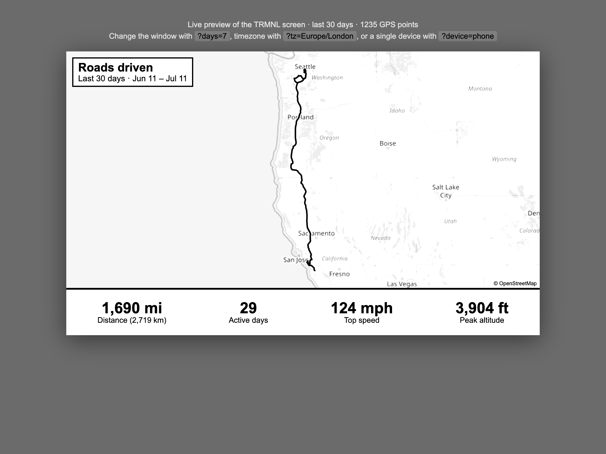

# TRMNL "WhereHaveIBeen" plugin

Displays your last 30 days of driving as a road map with headline stats, sized
for the TRMNL 800×480 black & white e-ink screen.

It is powered by the `GET /trmnl` endpoint in `app.py`, which fetches your
OwnTracks history, fits the GPS track to a slippy-map zoom, and returns the
positioned **OpenStreetMap basemap tiles** plus an SVG path for the route and
exact stats (distance, active days, top speed, peak altitude). The TRMNL markup
in `markup.liquid` lays the tiles down (grayscaled for e-ink) and draws the route
(white-cased black line) on top, with any flight legs as a dashed line. The routes
are vector `<path>`s, so they stay razor-sharp.

> Driving and flying are split the same way the main map does it — a step counts
> as flying when its speed tops 200 km/h or it jumps more than 100 km. Flight legs
> are drawn (dashed, connected to the ground track) but excluded from the distance
> total.

> The basemap uses the same OpenStreetMap tiles as the main map, but served
> through this app's own `/trmnl/tile/<z>/<x>/<y>.png` proxy. OSM requires a
> `Referer`/`User-Agent` on tile requests and TRMNL's renderer sends neither, so
> the proxy adds them and caches tiles in memory. For a pure line-only screen,
> pass `?basemap=none` (or drop the tile `` block from `markup.liquid`).



## Test it locally (no TRMNL needed)

The endpoints accept your **logged-in web session** as a fallback to the Basic
auth header, so testing in your browser is easy:

1. Run the app (`python app.py`) and sign in at `http://localhost:5000` as usual.
2. Open **`http://localhost:5000/trmnl/preview`** — this renders the real 800×480
   screen with your data, styled to look like the e-ink panel. Add query params
   to experiment, e.g. `…/trmnl/preview?days=7&tz=Europe/London`.
3. To see the raw JSON the TRMNL plugin will consume, open
   **`http://localhost:5000/trmnl`**.

If you open either while signed out, the browser shows a login prompt — enter
your OwnTracks username/password there. Or from the terminal:

```bash
curl -u 'YOUR_USER:YOUR_PASSWORD' http://localhost:5000/trmnl
```

## 1. Deploy

The endpoint ships as part of the Flask app. Deploy as usual (Fly.io), then it is
reachable at:

```
https://<your-domain>/trmnl
```

For the hosted instance that is `https://wherehaveibeen.fly.dev/trmnl` (use your
own domain if different).

## 2. Build your auth header

The endpoint authenticates with HTTP Basic auth passed straight through to
OwnTracks — the same credentials you log in with. TRMNL runs the poll on its
server, so it can't use a browser session; you give it the header instead.

Generate the header value from your OwnTracks `username:password`:

```bash
printf '%s' 'YOUR_USERNAME:YOUR_PASSWORD' | base64
```

That prints a string like `dXNlcjpwYXNz`. Your full header is:

```
Authorization: Basic dXNlcjpwYXNz
```

> The credentials are sent to *your own* server over HTTPS and forwarded to
> OwnTracks exactly as the web app already does. They are not stored by the
> plugin.

## 3. Create the TRMNL private plugin

In your TRMNL account: **Plugins → Private Plugin → Add New**.

| Field | Value |
|-------|-------|
| **Strategy** | `Polling` |
| **Polling URL** | `https://<your-domain>/trmnl` |
| **Polling Verb** | `GET` |
| **Polling Headers** | `Authorization: Basic <your base64 string>` (one per line) |
| **Remove bleed margin?** | `Yes` (the markup is full-bleed) |
| **Enable Dark Mode?** | `No` |

Leave **Polling Body** and **OAuth** empty.

Set the refresh interval on the plugin/playlist to whatever you like — every few
hours is plenty for a 30-day view and is gentle on the OwnTracks server.

## 4. Paste the markup

Click **Edit Markup**, select the **Full** layout, and paste the contents of
[`markup.liquid`](markup.liquid). Use the live preview to confirm the map and
stats render. Save.

> If a `{{ variable }}` shows up blank, open the **Merge Variables** dropdown in
> the editor to see the exact path TRMNL assigned the polled JSON and adjust the
> reference. Top-level names (`{{ map_d }}`, `{{ distance_fmt }}`, …) are the
> default for the Polling strategy.

## 5. (Optional) Pick the range from the plugin settings

Rather than hard-coding the window in the Polling URL, you can expose a dropdown
on the plugin's settings page so you can switch between "Last 7 days", "Last 30
days", "All time", etc. without editing the plugin.

TRMNL's **Form Fields** define custom variables that get interpolated into the
Polling URL. Paste this into the **Form Fields** box:

```yaml
- keyname: lookback_period
  field_type: select
  name: Look-back window
  default: "30"
  options:
    - "7"
    - "14"
    - "30"
    - "90"
    - "all"
```

The selected option is substituted **verbatim** into the URL — TRMNL does not
URL-encode it and (in the current editor) does not split a `Label:Value` pair.
So option values must be URL-safe: **no spaces and no colons**, which rules out
pretty labels like `Last 7 days`. Keep them as bare `days` values (`7`, `30`,
`all`, …). Then reference the field in the **Polling URL** with plain Liquid
braces — **no `##` prefix**, spaces inside the braces:

```
https://<your-domain>/trmnl?days={{ lookback_period }}
```

> Get this exact — it is the one thing that repeatedly breaks. The form-field
> reference in a polling URL is `{{ keyname }}`, **not** `##{{ keyname }}`. The
> `##` prefix (shown on some TRMNL help pages) leaves the placeholder
> un-substituted, so TRMNL sends the literal `{{…}}` text and the fetch fails,
> rendering a blank screen. The endpoint is also defensive: an unset, stale, or
> un-substituted value falls back to a **30-day window** rather than erroring.

The endpoint accepts `all` (or `0`) for the whole history; for "All time" the
header shows the actual span of your data (e.g. `Mar 3, 2023 – Jul 11, 2026`)
instead of a day count. Add or remove options freely — any positive integer
works as a `days` value.

> **If it renders blank** (ghost "WhereHaveIBeen ·" header, empty stats), the poll
> is failing and TRMNL is rendering with no data — it is *not* your endpoint. To
> confirm, temporarily set the Polling URL to a plain `https://<your-domain>/trmnl`
> (no query at all): it defaults to 30 days and must render. If that works, the
> problem is purely the `##{{…}}` interpolation above.

## Endpoint options (query params)

All optional:

| Param | Default | Meaning |
|-------|---------|---------|
| `days` | `30` | Look-back window in days. Pass `all` (or `0`) for the whole history. Anything unset, empty, or unparseable falls back to `30` |
| `tz` | `America/Los_Angeles` | IANA timezone for the date range label |
| `device` | *(auto)* | Restrict to one OwnTracks device. Omitted, it auto-detects and merges all your devices (the recorder requires a device, so this is discovered via `/api/0/last`) |
| `basemap` | `osm` | OpenStreetMap basemap behind the route. Pass `none` for a line-only screen |
| `w` / `h` | `800` / `400` | Map drawing area in px (must match the SVG `viewBox` in the markup) |

Example — 14 days, London time, one device:

```
https://<your-domain>/trmnl?days=14&tz=Europe/London&device=phone
```

## JSON returned by the endpoint

```jsonc
{
  "map_d":          "M120 40 L121 42 ...",  // SVG path, driving segments (solid line)
  "fly_d":          "M120 40 L600 300 ...", // SVG path, flight segments (dashed line)
  "has_data":       true,
  "width":          800,
  "height":         400,
  "days":           30,                     // or "all"
  "range_label":    "Last 30 days",         // "All time" when days=all
  "date_range":     "Jun 11 – Jul 11",
  "distance_fmt":   "188 mi",
  "distance_km_fmt":"302 km",
  "top_speed_fmt":  "40 mph",
  "max_alt_fmt":    "459 ft",
  "active_days_fmt":"25",
  "point_count":    3190
}
```
